---
## Front matter
title: "Отчёта по лабораторной работе 8"
subtitle: "Команды безусловного и условного переходов в Nasm. Программирование ветвлений"
author: "Касканте Родригес Альберто"

## Generic otions
lang: ru-RU
toc-title: "Содержание"

## Bibliography
bibliography: bib/cite.bib
csl: pandoc/csl/gost-r-7-0-5-2008-numeric.csl

## Pdf output format
toc: true # Table of contents
toc-depth: 2
lof: true # List of figures
lot: true # List of tables
fontsize: 12pt
linestretch: 1.5
papersize: a4
documentclass: scrreprt
## I18n polyglossia
polyglossia-lang:
  name: russian
  options:
	- spelling=modern
	- babelshorthands=true
polyglossia-otherlangs:
  name: english
## I18n babel
babel-lang: russian
babel-otherlangs: english
## Fonts
mainfont: PT Serif
romanfont: PT Serif
sansfont: PT Sans
monofont: PT Mono
mainfontoptions: Ligatures=TeX
romanfontoptions: Ligatures=TeX
sansfontoptions: Ligatures=TeX,Scale=MatchLowercase
monofontoptions: Scale=MatchLowercase,Scale=0.9
## Biblatex
biblatex: true
biblio-style: "gost-numeric"
biblatexoptions:
  - parentracker=true
  - backend=biber
  - hyperref=auto
  - language=auto
  - autolang=other*
  - citestyle=gost-numeric
## Pandoc-crossref LaTeX customization
figureTitle: "Рис."
tableTitle: "Таблица"
listingTitle: "Листинг"
lofTitle: "Список иллюстраций"
lotTitle: "Список таблиц"
lolTitle: "Листинги"
## Misc options
indent: true
header-includes:
  - \usepackage{indentfirst}
  - \usepackage{float} # keep figures where there are in the text
  - \floatplacement{figure}{H} # keep figures where there are in the text
---

# Цель работы

Целью работы является изучение команд условного и безусловного переходов. Приобретение навыков написания программ с использованием переходов. Знакомство с назначением и структурой файла листинга.

# Выполнение лабораторной работы

1. Создайте каталог для программам лабораторной работы № 8, перейдите в него и создайте файл lab8-1.asm

2. Инструкция jmp в NASM используется для реализации безусловных переходов. Рассмотрим пример программы с использованием инструкции jmp.
Введите в файл lab8-1.asm текст программы из листинга 8.1. (рис. [-@fig:001])

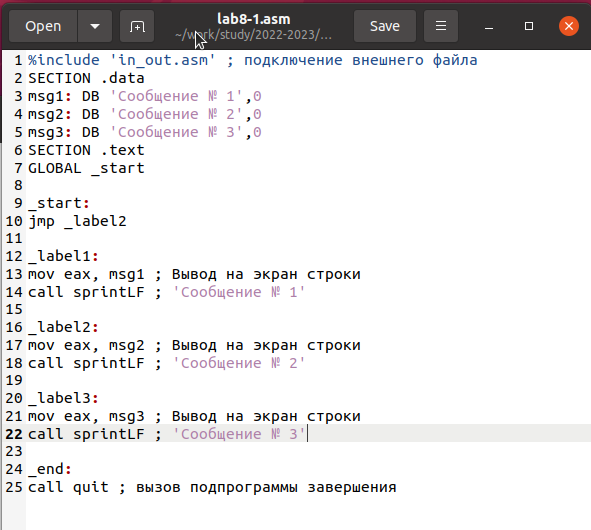{ #fig:001 width=70%, height=70% }

Создайте исполняемый файл и запустите его. (рис. [-@fig:002])

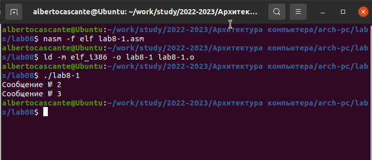{ #fig:002 width=70%, height=70% }

Инструкция jmp позволяет осуществлять переходы не только вперед но
и назад. Изменим программу таким образом, чтобы она выводила сначала
‘Сообщение № 2’, потом ‘Сообщение № 1’ и завершала работу. Для этого в
текст программы после вывода сообщения № 2 добавим инструкцию jmp с
меткой _label1 (т.е. переход к инструкциям вывода сообщения № 1) и после
вывода сообщения № 1 добавим инструкцию jmp с меткой _end (т.е. переход к
инструкции call quit). Измените текст программы в соответствии с листингом
8.2. (рис. [-@fig:003], [-@fig:004])

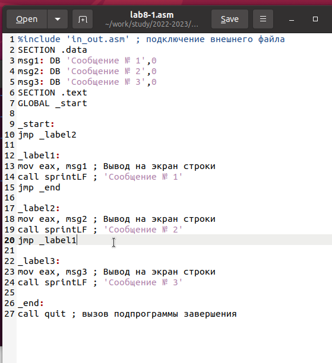{ #fig:003 width=70%, height=70% }

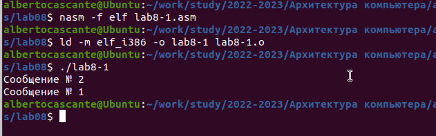{ #fig:004 width=70%, height=70% }

Измените текст программы добавив или изменив инструкции jmp, чтобы
вывод программы был следующим (рис. [-@fig:005], [-@fig:006]):

```
Сообщение № 3
Сообщение № 2
Сообщение № 1
```

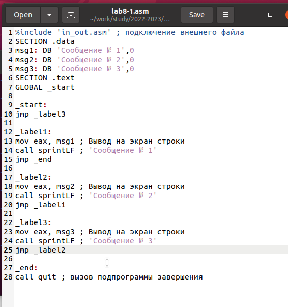{ #fig:005 width=70%, height=70% }

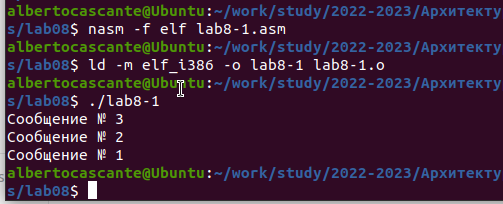{ #fig:006 width=70%, height=70% }

3. Использование инструкции jmp приводит к переходу в любом случае. Однако, часто при написании программ необходимо использовать условные
переходы, т.е. переход должен происходить если выполнено какое-либо
условие. В качестве примера рассмотрим программу, которая определяет
и выводит на экран наибольшую из 3 целочисленных переменных: A,B
и C. Значения для A и C задаются в программе, значение B вводиться с
клавиатуры. Создайте исполняемый файл и проверьте его работу для разных значений B.
(рис. [-@fig:007], [-@fig:008])

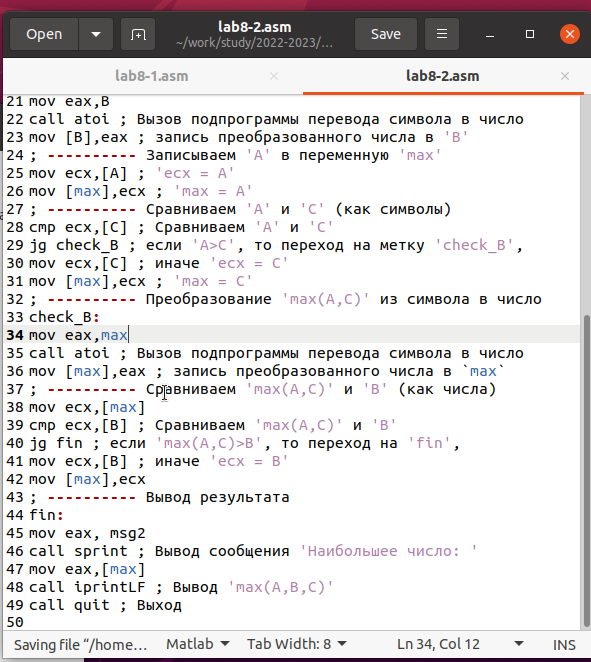{ #fig:007 width=70%, height=70% }

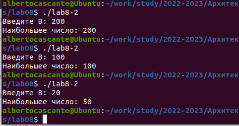{ #fig:008 width=70%, height=70% }

4. Обычно nasm создаёт в результате ассемблирования только объектный
файл. Получить файл листинга можно, указав ключ -l и задав имя файла
листинга в командной строке. Создайте файл листинга для программы из
файла lab8-2.asm (рис. [-@fig:009])

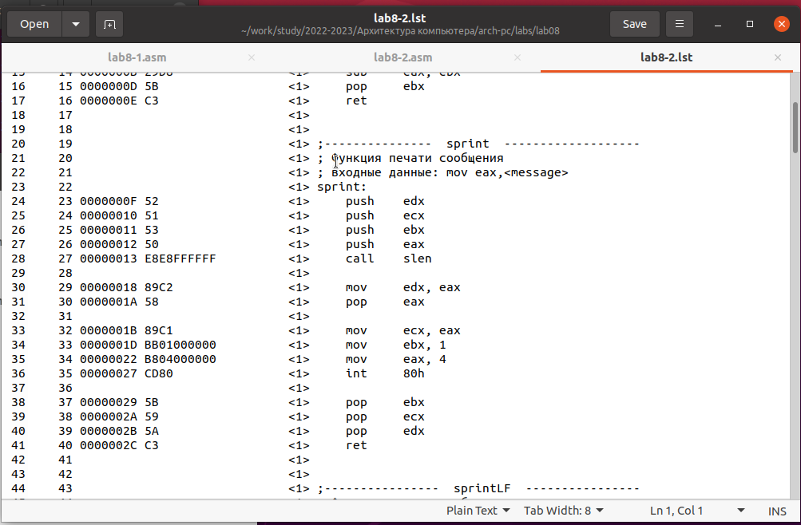{ #fig:009 width=70%, height=70% }

Внимательно ознакомиться с его форматом и содержимым. Подробно объяснить содержимое трёх строк файла листинга по выбору.

строка 51

* 51 - номер строки

* 00000033 - адрес

* B80A000000 - машинный код

* mov     eax, 0AH - код программы

строка 52

* 52 - номер строки

* 00000038 - адрес

* 50 - машинный код

* push    eax- код программы

строка 53

* 53 - номер строки

* 00000039 - адрес

* 89E0 - машинный код

* mov     eax, esp - код программы

Откройте файл с программой lab8-2.asm и в любой инструкции с двумя
операндами удалить один операнд. Выполните трансляцию с получением файла
листинга (рис. [-@fig:010],[-@fig:011])

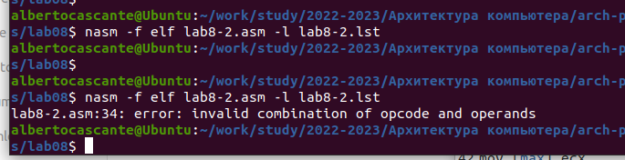{ #fig:010 width=70%, height=70% }

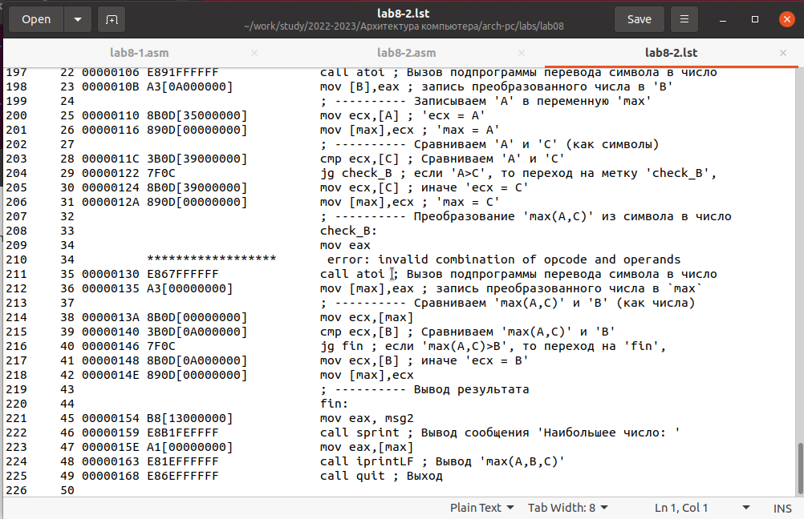{ #fig:011 width=70%, height=70% }

5. Напишите программу нахождения наименьшей из 3 целочисленных переменных a,b и c. Значения переменных выбрать из табл. 8.5 в соответствии
с вариантом, полученным при выполнении лабораторной работы № 7.
Создайте исполняемый файл и проверьте его работу (рис. [-@fig:012],[-@fig:013])

для варианта 20 - 95, 2, 61

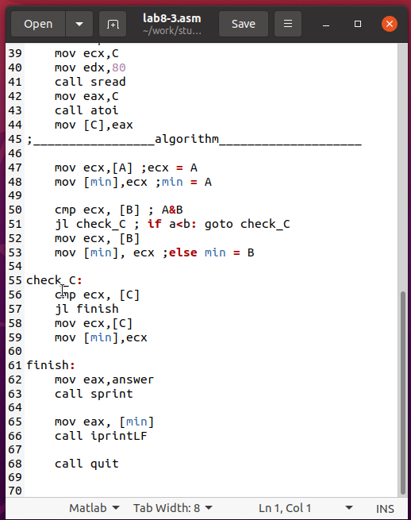{ #fig:012 width=70%, height=70% }

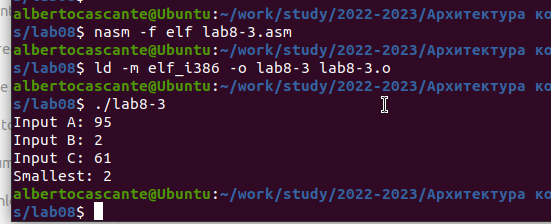{ #fig:013 width=70%, height=70% }

6. Напишите программу, которая для введенных с клавиатуры значений x
и a вычисляет значение заданной функции f(x) и выводит результат вычислений. Вид функции f(x) выбрать из таблицы 8.6 вариантов заданий в
соответствии с вариантом, полученным при выполнении лабораторной работы № 7. Создайте исполняемый файл и проверьте его работу для значений X и a из 8.6.
(рис. [-@fig:014],[-@fig:015])

для варианта 20

$$
 \begin{cases}
	x-a, x>=a
	\\   
	5, x < a
 \end{cases}
$$

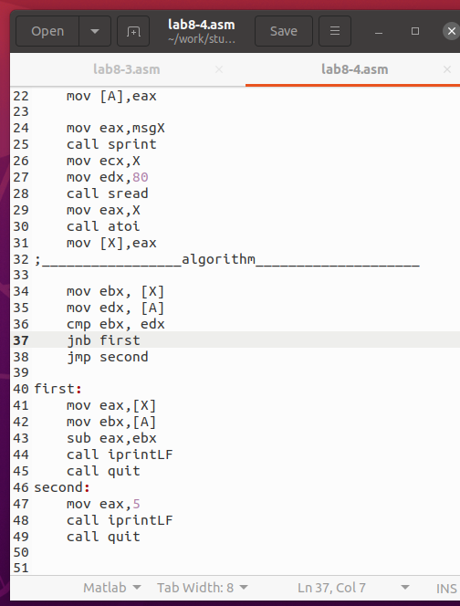{ #fig:014 width=70%, height=70% }

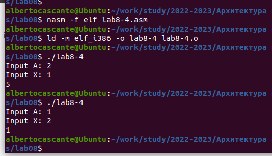{ #fig:015 width=70%, height=70% }

# Выводы

Изучили команды условного и безусловного переходов, познакомились с фалом листинга.
