---
## Front matter
title: "Отчёта по лабораторной работе 10"
subtitle: "Понятие подпрограммы. Отладчик GDB."
author: "Касканте Родригес Альберто"

## Generic otions
lang: ru-RU
toc-title: "Содержание"

## Bibliography
bibliography: bib/cite.bib
csl: pandoc/csl/gost-r-7-0-5-2008-numeric.csl

## Pdf output format
toc: true # Table of contents
toc-depth: 2
lof: true # List of figures
lot: true # List of tables
fontsize: 12pt
linestretch: 1.5
papersize: a4
documentclass: scrreprt
## I18n polyglossia
polyglossia-lang:
  name: russian
  options:
	- spelling=modern
	- babelshorthands=true
polyglossia-otherlangs:
  name: english
## I18n babel
babel-lang: russian
babel-otherlangs: english
## Fonts
mainfont: PT Serif
romanfont: PT Serif
sansfont: PT Sans
monofont: PT Mono
mainfontoptions: Ligatures=TeX
romanfontoptions: Ligatures=TeX
sansfontoptions: Ligatures=TeX,Scale=MatchLowercase
monofontoptions: Scale=MatchLowercase,Scale=0.9
## Biblatex
biblatex: true
biblio-style: "gost-numeric"
biblatexoptions:
  - parentracker=true
  - backend=biber
  - hyperref=auto
  - language=auto
  - autolang=other*
  - citestyle=gost-numeric
## Pandoc-crossref LaTeX customization
figureTitle: "Рис."
tableTitle: "Таблица"
listingTitle: "Листинг"
lofTitle: "Список иллюстраций"
lotTitle: "Список таблиц"
lolTitle: "Листинги"
## Misc options
indent: true
header-includes:
  - \usepackage{indentfirst}
  - \usepackage{float} # keep figures where there are in the text
  - \floatplacement{figure}{H} # keep figures where there are in the text
---

# Цель работы

Целью работы является приобретение навыков написания программ с использованием подпрограмм.
Знакомство с методами отладки при помощи GDB и его основными возможностями.

# Выполнение лабораторной работы

1. Создайте каталог для выполнения лабораторной работы № 10, перейдите
в него и создайте файл lab10-1.asm:

2. В качестве примера рассмотрим программу вычисления арифметического
выражения f(x) = 2x+7 с помощью подпрограммы calcul. В данном
примере x вводится с клавиатуры, а само выражение вычисляется в подпрограмме. 
Внимательно изучите текст программы (Листинг 10.1). (рис. [-@fig:001], [-@fig:002])

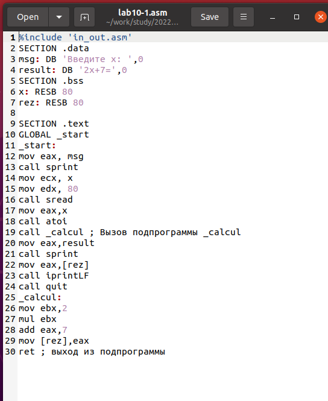{ #fig:001 width=70%, height=70% }

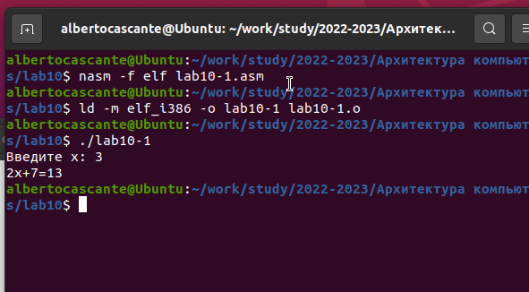{ #fig:002 width=70%, height=70% }

3. Измените текст программы, добавив подпрограмму subcalcul в подпрограмму calcul, 
для вычисления выражения f(g(x)), где x вводится с клавиатуры, 
f(x) = 2x + 7, g(x) = 3x − 1(рис. [-@fig:003], [-@fig:004])

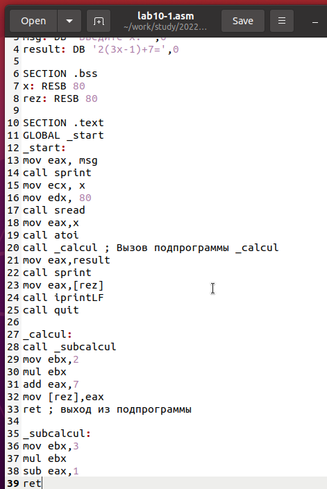{ #fig:003 width=70%, height=70% }

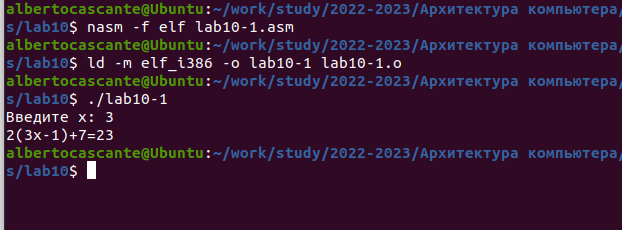{ #fig:004 width=70%, height=70% }

4. Создайте файл lab10-2.asm с текстом программы из Листинга 10.2. (Программа печати сообщения Hello world!):
(рис. [-@fig:005])

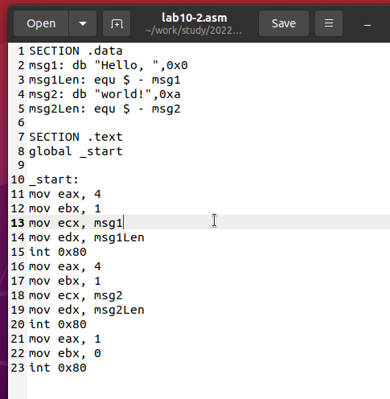{ #fig:005 width=70%, height=70% }

Получите исполняемый файл. Для работы с GDB в исполняемый файл необходимо добавить отладочную информацию, 
для этого трансляцию программ необходимо проводить с ключом ‘-g’.
Загрузите исполняемый файл в отладчик gdb:
Проверьте работу программы, запустив ее в оболочке GDB с помощью команды run (сокращённо r):(рис. [-@fig:006])

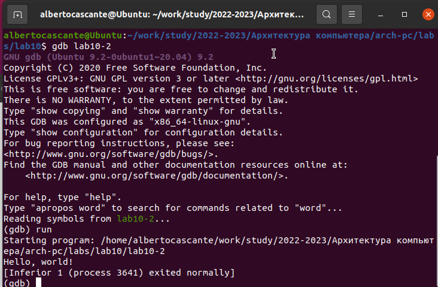{ #fig:006 width=70%, height=70% }

Для более подробного анализа программы установите брейкпоинт на метку
start, с которой начинается выполнение любой ассемблерной программы, и запустите её.
Посмотрите дисассимилированный код программы  (рис. [-@fig:007], [-@fig:008])

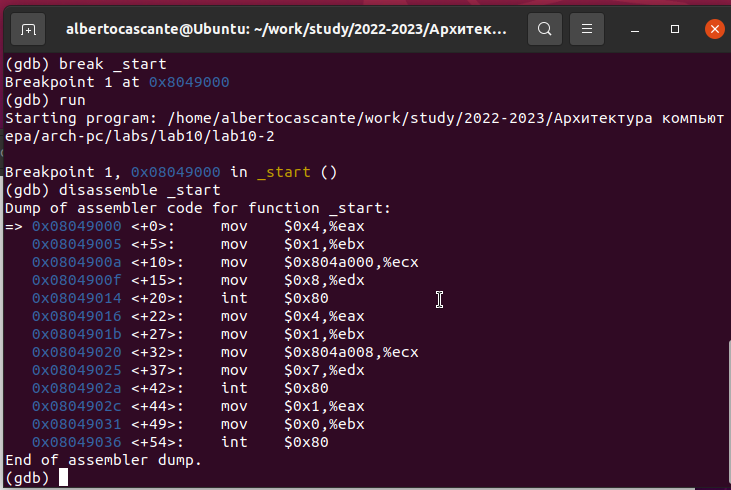{ #fig:007 width=70%, height=70% }

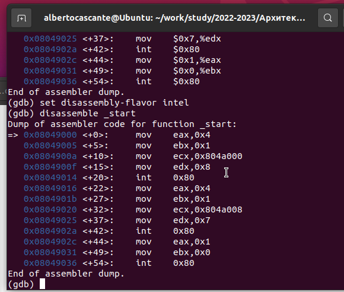{ #fig:008 width=70%, height=70% }

На предыдущих шагах была установлена точка останова по имени метки (_start). 
Проверьте это с помощью команды info breakpoints (кратко i b)
Установим еще одну точку останова по адресу инструкции. Адрес инструкции можно увидеть в средней части экрана в левом столбце соответствующей
инструкции. Определите адрес предпоследней инструкции (mov ebx,0x0) и установите точку.(рис. [-@fig:009])

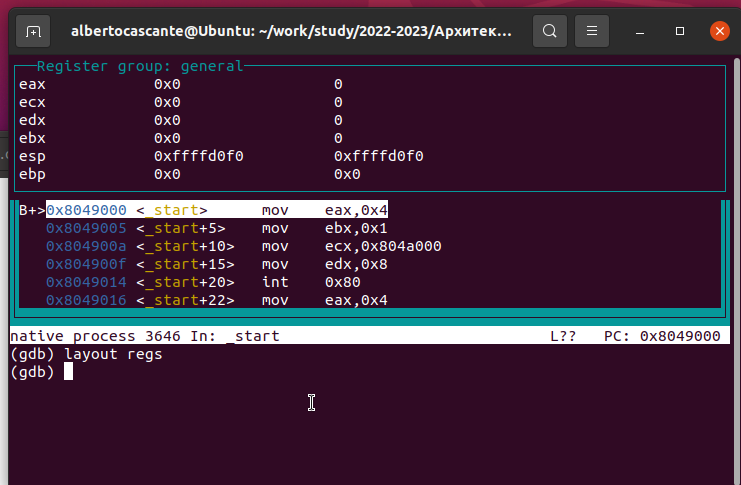{ #fig:009 width=70%, height=70% }

Отладчик может показывать содержимое ячеек памяти и регистров, а при
необходимости позволяет вручную изменять значения регистров и переменных.
Выполните 5 инструкций с помощью команды stepi (или si) и проследите за
изменением значений регистров. (рис. [-@fig:011] [-@fig:012])

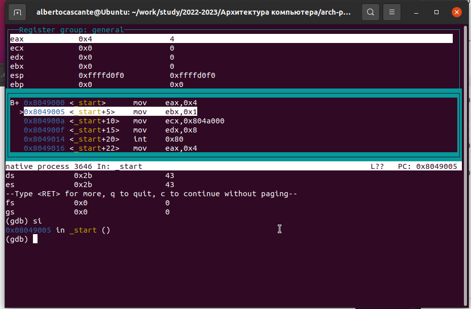{ #fig:010 width=70%, height=70% }

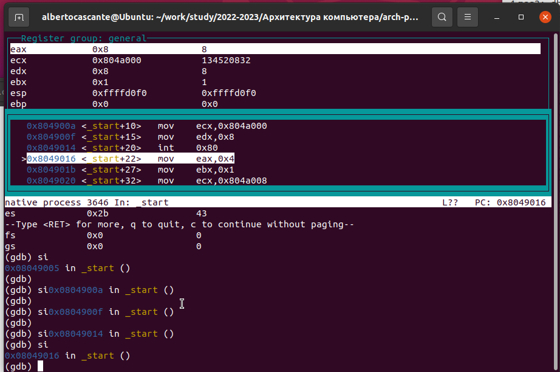{ #fig:011 width=70%, height=70% }

Посмотрите значение переменной msg1 по имени
Посмотрите значение переменной msg2 по адресу
Изменить значение для регистра или ячейки памяти можно с помощью команды set, 
задав ей в качестве аргумента имя регистра или адрес. 
Измените первый символ переменной msg1 
Замените любой символ во второй переменной msg2. (рис. [-@fig:012])

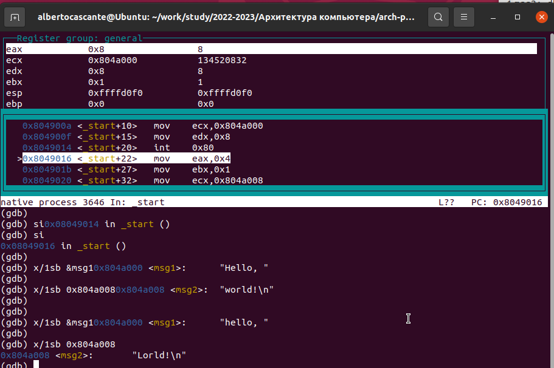{ #fig:012 width=70%, height=70% }

Выведете в различных форматах (в шестнадцатеричном формате, в двоичном формате и в символьном виде) 
значение регистра edx.
С помощью команды set измените значение регистра ebx:(рис. [-@fig:013])

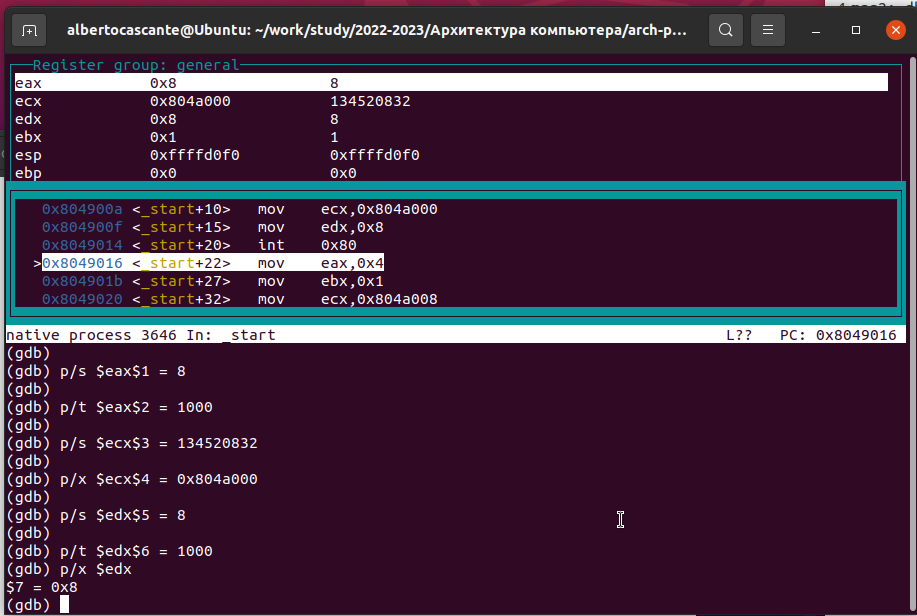{ #fig:013 width=70%, height=70% }

С помощью команды set измените значение регистра ebx:(рис. [-@fig:014])

{ #fig:014 width=70%, height=70% }

5. Скопируйте файл lab9-2.asm, созданный при выполнении лабораторной работы №9, 
с программой выводящей на экран аргументы командной строки. Создайте исполняемый файл.
Для загрузки в gdb программы с аргументами необходимо использовать ключ
--args. Загрузите исполняемый файл в отладчик, указав аргументы

Для начала установим точку останова перед первой инструкцией в программе
и запустим ее.

Адрес вершины стека храниться в регистре esp и по этому адресу располагается число равное количеству аргументов командной строки (включая имя
программы):
Как видно, число аргументов равно 5 – это имя программы lab10-3 и 
непосредственно аргументы: аргумент1, аргумент, 2 и 'аргумент 3'.

Посмотрите остальные позиции стека – по адесу [esp+4] располагается адрес
в памяти где находиться имя программы, по адесу [esp+8] храниться адрес
первого аргумента, по аресу [esp+12] – второго и т.д. (рис. [-@fig:015])

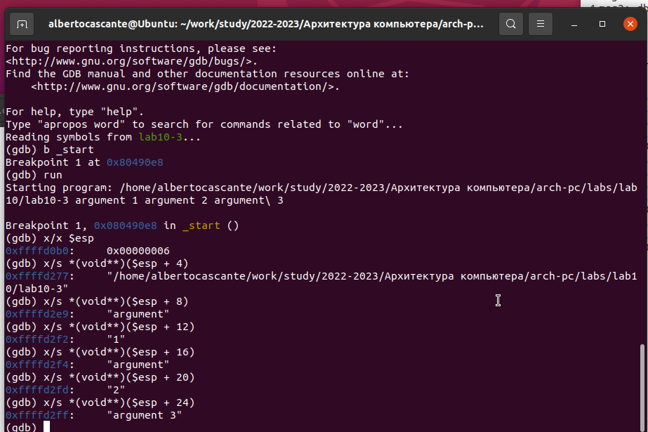{ #fig:015 width=70%, height=70% }

Объясните, почему шаг изменения адреса равен 4 ([esp+4], [esp+8], [esp+12] - 
шаг равен размеру переменной - 4 байтам.

6. Преобразуйте программу из лабораторной работы №9 (Задание №1 для
самостоятельной работы), реализовав вычисление значения функции f(x)
как подпрограмму. (рис. [-@fig:016] [-@fig:017])

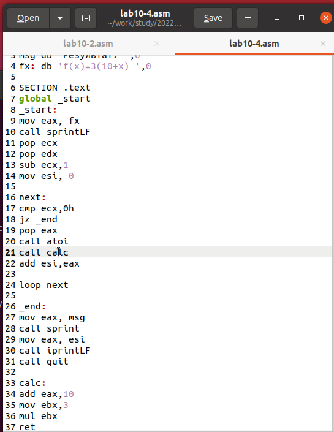{ #fig:016 width=70%, height=70% }

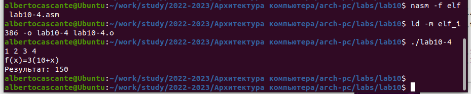{ #fig:017 width=70%, height=70% }

7. В листинге приведена программа вычисления выражения (3+2)*4+5.
При запуске данная программа дает неверный результат. Проверьте это.
С помощью отладчика GDB, анализируя изменения значений регистров,
определите ошибку и исправьте ее.(рис. [-@fig:018] [-@fig:019] [-@fig:020] [-@fig:021])

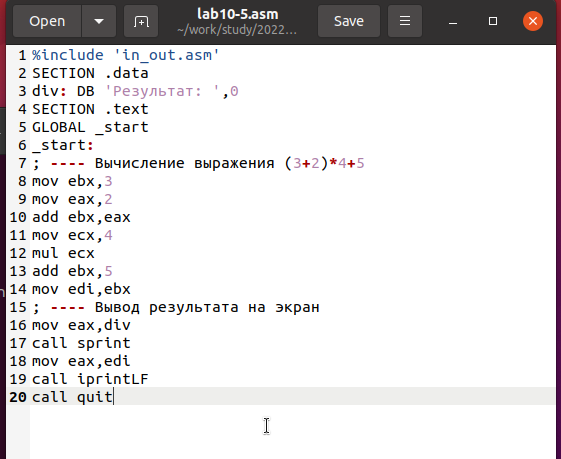{ #fig:018 width=70%, height=70% }

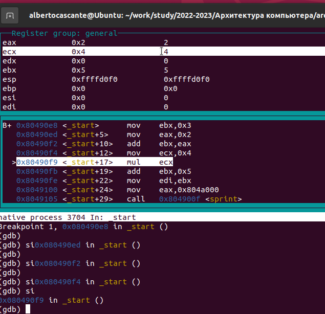{ #fig:019 width=70%, height=70% }

Отметим, что перепутан порядок аргументов у инструкции add и что по окончании работы в edi 
отправляется ebx вместо eax

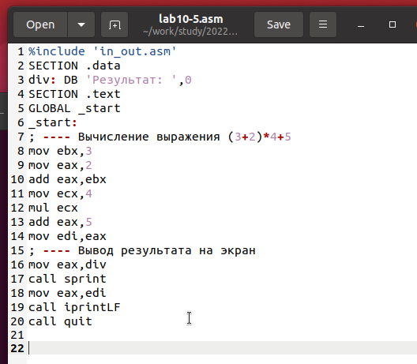{ #fig:020 width=70%, height=70% }

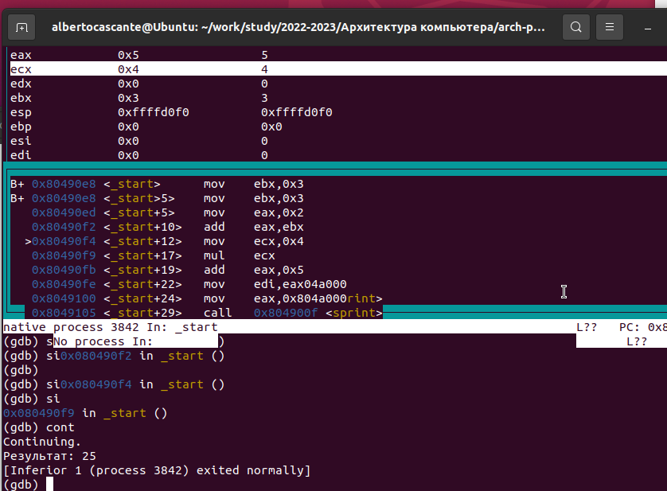{ #fig:021 width=70%, height=70% }

# Выводы

Освоили работy с подпрограммами и отладчиком.

