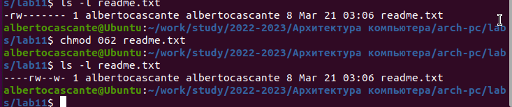

---
## Front matter
title: "Отчёта по лабораторной работе 11"
subtitle: "Работа с файлами средствами Nasm"
author: "Касканте Родригес Альберто"

## Generic otions
lang: ru-RU
toc-title: "Содержание"

## Bibliography
bibliography: bib/cite.bib
csl: pandoc/csl/gost-r-7-0-5-2008-numeric.csl

## Pdf output format
toc: true # Table of contents
toc-depth: 2
lof: true # List of figures
lot: true # List of tables
fontsize: 12pt
linestretch: 1.5
papersize: a4
documentclass: scrreprt
## I18n polyglossia
polyglossia-lang:
  name: russian
  options:
	- spelling=modern
	- babelshorthands=true
polyglossia-otherlangs:
  name: english
## I18n babel
babel-lang: russian
babel-otherlangs: english
## Fonts
mainfont: PT Serif
romanfont: PT Serif
sansfont: PT Sans
monofont: PT Mono
mainfontoptions: Ligatures=TeX
romanfontoptions: Ligatures=TeX
sansfontoptions: Ligatures=TeX,Scale=MatchLowercase
monofontoptions: Scale=MatchLowercase,Scale=0.9
## Biblatex
biblatex: true
biblio-style: "gost-numeric"
biblatexoptions:
  - parentracker=true
  - backend=biber
  - hyperref=auto
  - language=auto
  - autolang=other*
  - citestyle=gost-numeric
## Pandoc-crossref LaTeX customization
figureTitle: "Рис."
tableTitle: "Таблица"
listingTitle: "Листинг"
lofTitle: "Список иллюстраций"
lotTitle: "Список таблиц"
lolTitle: "Листинги"
## Misc options
indent: true
header-includes:
  - \usepackage{indentfirst}
  - \usepackage{float} # keep figures where there are in the text
  - \floatplacement{figure}{H} # keep figures where there are in the text
---

# Цель работы

Целью работы является приобретение навыков написания программ для работы с файлами.

# Выполнение лабораторной работы

1. 1. Создайте каталог для программам лабораторной работы № 11, перейдите
в него и создайте файл lab11-1.asm и readme.txt:

2. Введите в файл lab11-1.asm текст программы из листинга 11.1 (Программа
записи в файл сообщения). Создайте исполняемый файл и проверьте его
работу. (рис. [-@fig:001], [-@fig:002])

{ #fig:001 width=70%, height=70% }

{ #fig:002 width=70%, height=70% }

3. С помощью команды chmod измените права доступа к исполняемому файлу
lab11-1, запретив его выполнение. Попытайтесь выполнить файл. Объясните результат. (рис. [-@fig:003])
Файл не запускается, поскольку запуск запрещен.

{ #fig:003 width=70%, height=70% }

4. С помощью команды chmod измените права доступа к файлу lab11-1.asm с
исходным текстом программы,добавив права на исполнение. Попытайтесь
выполнить его и объясните результат (рис. [-@fig:004])
Файл запускается и терминал пытается выполнить его содержимое как консольные команды.

{ #fig:004 width=70%, height=70% }

5. Предоставить права доступа к файлу readme.txt в соответствии с вариантом в таблице 11.4. Проверить правильность выполнения с помощью
команды ls -l. (рис. [-@fig:005])

для варианта 20: ```--- rw- -w-```

{ #fig:005 width=70%, height=70% }

6. Напишите программу работающую по следующему алгоритму (рис. [-@fig:006], [-@fig:007]):

* Вывод приглашения “Как Вас зовут?”

* ввести с клавиатуры свои фамилию и имя

* создать файл с именем name.txt

* записать в файл сообщение “Меня зовут”

* дописать в файл строку введенную с клавиатуры

* закрыть файл

{ #fig:006 width=70%, height=70% }

{ #fig:007 width=70%, height=70% }

# Выводы

Освоили работy с файлами и правами доступа.
